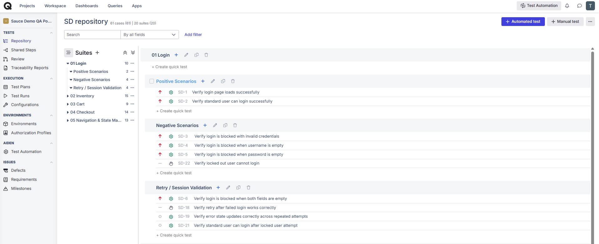
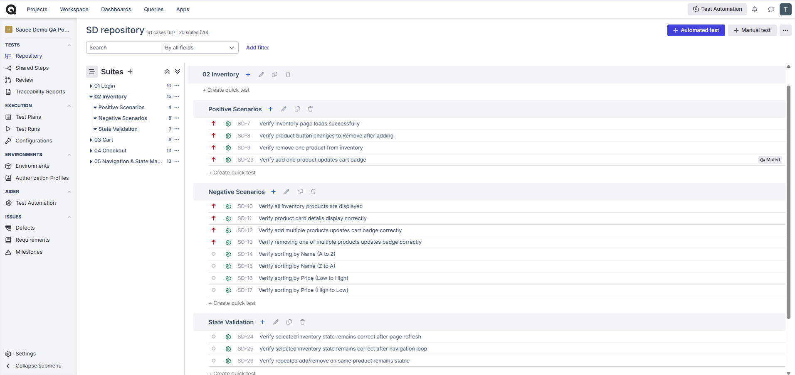
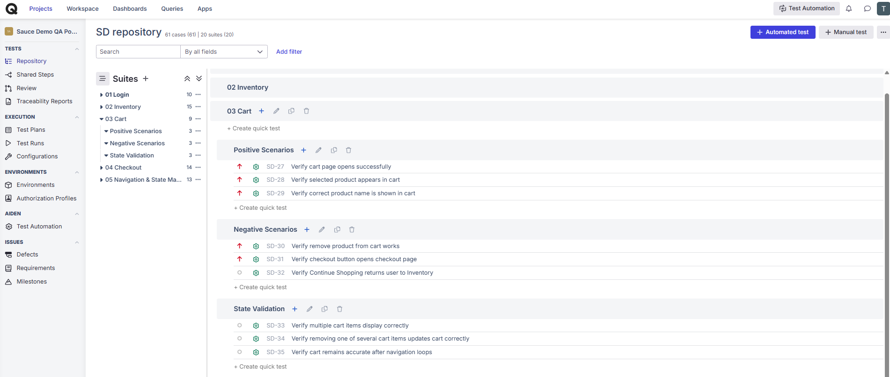
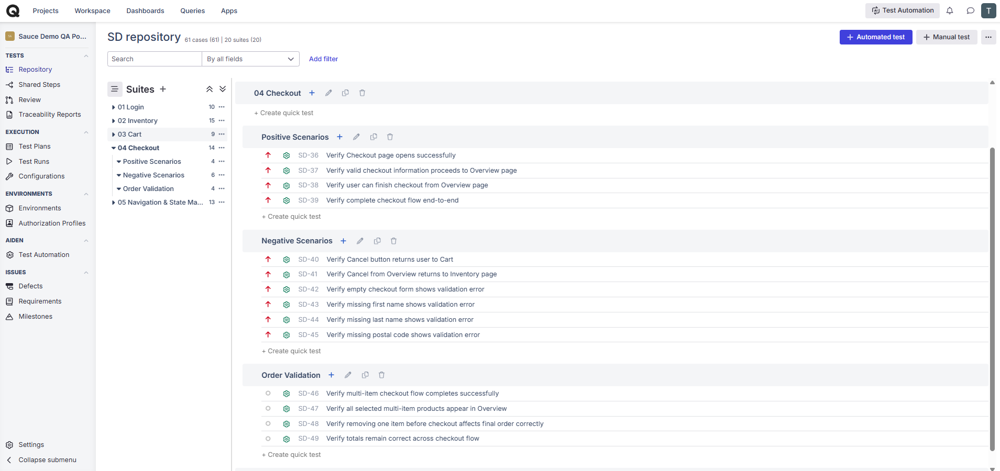
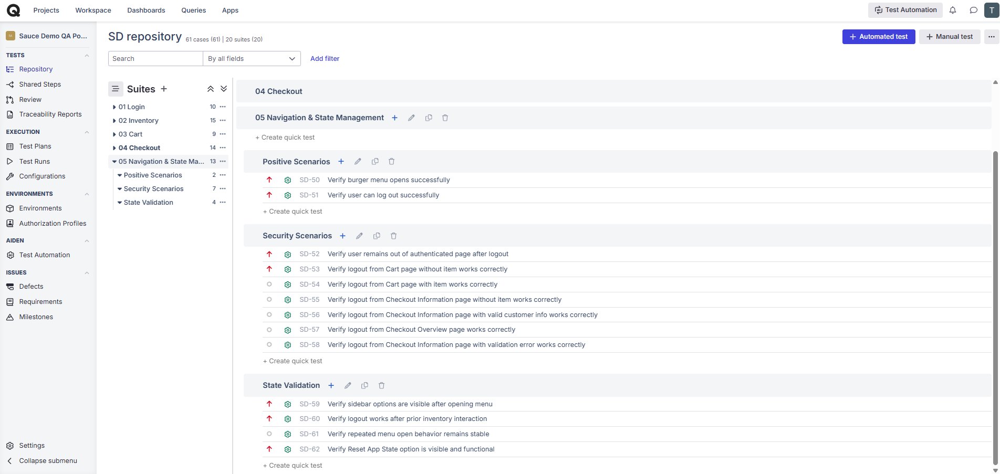

# Sauce Demo Cypress Automation Framework

## Project Overview

This project is an End-to-End (E2E) Cypress automation framework built for Sauce Demo.

The framework validates the complete retail purchase workflow including authentication, product selection, cart validation, checkout process, order completion, and application state management.

This project follows a real QA structure using business-domain ownership instead of page-per-file test design.

---

## Business Flow Covered

Login  
→ Inventory  
→ Cart  
→ Checkout Information  
→ Checkout Overview  
→ Order Completion  
→ Navigation & State Management

---

## Project Modules

### Module 1 — Login

- Valid Login
- Invalid Login
- Locked User Validation
- Protected Access Validation

### Module 2 — Inventory

- Add to Cart
- Remove Product
- Multiple Product Selection
- Product Sorting Validation
- Inventory State Persistence

### Module 3 — Cart

- Cart Validation
- Product Presence Validation
- Remove from Cart
- Continue Shopping
- Checkout Navigation

### Module 4 — Checkout

- Checkout Information Validation
- Checkout Overview Validation
- Finish Order Flow
- Negative Form Validation
- Totals Validation

### Module 5 — Navigation & State Management

- Burger Menu Validation
- Logout Flow
- Reset App State
- Navigation Stability
- Browser State Validation

---

## Tech Stack

- Cypress
- JavaScript
- Mocha
- Chai
- Git
- GitHub
- Qase

---

## Test Types Covered

- Smoke Testing
- Functional Testing
- Negative Testing
- End-to-End Testing
- Resilience Testing
- State Validation

---

# Manual QA Documentation

This project also includes supporting manual QA documentation to reflect real-world QA process beyond automation execution.

## Sauce Demo Manual QA Test Cases

Manual test cases were created in Qase under the section:

### Sauce Demo Manual QA Test Cases

The test case repository covers:

- Module 1 — Login
- Module 2 — Inventory
- Module 3 — Cart
- Module 4 — Checkout
- Module 5 — Checkout
- Module 6 — Navigation & State Management

Coverage includes:

- Functional validation
- Negative scenarios
- End-to-End flow validation
- State validation
- Business flow verification
- Critical user journey testing

Qase was used for:

- Test Case Management
- Test Execution Tracking
- Defect Documentation
- Validation Coverage
- Manual QA Workflow Organization

Screenshots and exported documentation are included in this repository for review.

---

